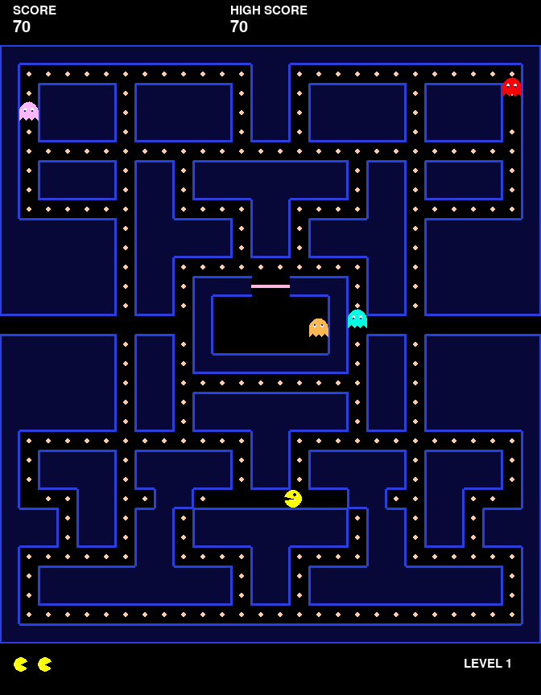

# Pac-Man Game (Python + PyGame)

A complete, playable clone of the classic 1980 arcade game, written from scratch
with clean object-oriented Python. It features the real maze, four ghosts with
distinct AI personalities, power pellets, frightened/edible ghosts, lives,
scoring, multiple levels, synthesised sound effects, and smooth animation — all
with no binary asset files (the graphics are drawn and the sounds are generated
in code).

